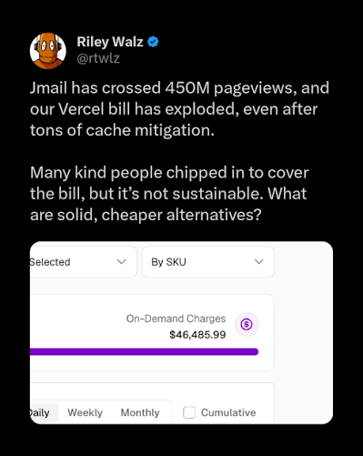
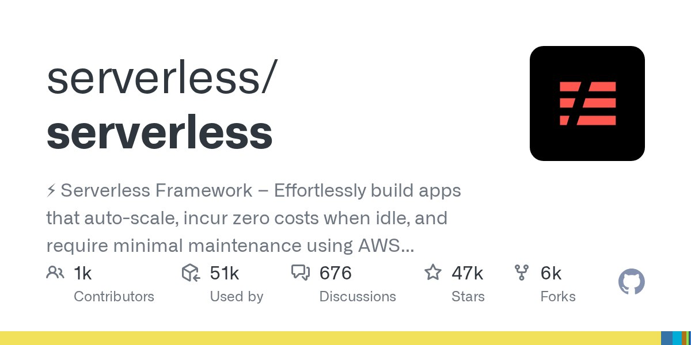
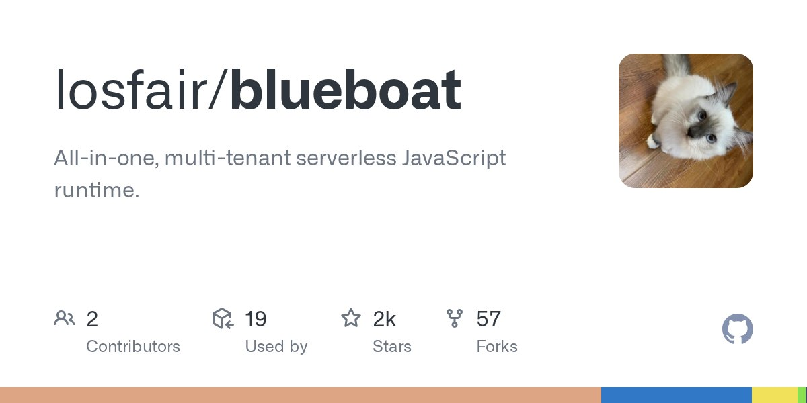

Everyone yaps about serverless. Someone still has to pay for their servers (just not me) 
but somehow every major tech company is loving it for absolutely no reason. Why would they,
at any certain point, provide us (poor users) the opportunity to even occupy some space on
their servers? I could probably come up with a few words:

**It's f\*\*king cheap.**

Serverless computing is so cheap to maintain that
they focus more on selling other products or perks, such as additional computation
resource for paid users. Take the frontend cartel [Vercel](https://vercel.com) for example,
most bloatware-filled NextJS projects deployed on the platform use their serverless compute.
Ignoring the fact that they strictly tied the NextJS ecosystem to their platform, generally 
speaking, they *did* successfully propel developers to ship their projects on their 
platforms because of its nice integration with GitHub and its ease of deployment. What's more,
thanks to serverless compute, not only do users find their services fast, Vercel is happy
because everything is automated and resource is all under their control.

To speed things even faster, we can build lots of servers or nodes near you, so you can connect
to the nearest one, the server runs a copy of your deployment, and there's their website right 
in front of your eyes in milliseconds or less. We call that "edge" computing.

But that speed comes with a cost, literally.



Their site is [JMail](https://jmail.world). Similar to an archive, it serves numerous static
files and ended up with this obscene bill.
In brief, Vercel charges for every million edge requests, and a massive volume of individual 
asset requests (JS, CSS, images). It wasn't until the fricking CEO showed up and publicly 
offered to personally cover the hosting expenses that the developer got to relieve.

Some view the CEO as someone who's friendly and helpful, and that Vercel is actually caring;
others see a written script, and they think this is all just for enhancing their corporate image.
But boy, oh boy, because what I see is some quick money. Let's make a service and advertise it as 
**The AI Cloud** because slop marketing works really well. Then, we can tighten our belt a bit and
rent a lot of servers scattered around the world, and introduce **Private Edge Compute**. Oh god,
I think we're ready to be a millionare!

Except you'll soon realize that everyone is doing the same thing. They build upon similar ideas,
similar infrastructures, and serverless compute keeps showing up in your mind until you slowly 
perceive that the ultimate winner is always them, not us.

In fact, why bother? When everyone is over there shouting "all heil capitalism," why not try to 
demystify what actually makes up the serverless infrastructure? What drives it so fast? What makes
it so efficient?

You see, serverless doesn't necessarily have to be pivoted to a direction where cash comes into play.
It's actually really interesting to think about it.

Heck, let's build our own.

# Anyone?

Alright, let's first set our goals here.

1. **It shouldn't be based on Docker.** What's the fun when everything is wrapped for you?
2. **It should be for JavaScript.** That makes it easier to work with.
3. **It must be simple.** Again, easier to work with.

So, let's look things up. Perhaps somebody out there in the broad field of open-source had figured
this out and we can learn from them.

Our first candidate is [`serverless/serverless`](https://github.com/serverless/serverless):



First impressions: corporate as f\*\*k. Second of all, it looks like it takes itself too seriously
to a point where programming just seems dull and boring. Lastly, it's too heavy; there's too many
configurations to deal with.

Let's take a look at our second candidate, [`losfair/blueboat`](https://github.com/losfair/blueboat):



Alright, this one looks a lot calmer, and it's written in Rust! Sadly, it's a bit outdated, at the time
I'm writing this, it has been 4 years since the last commit. However, it's still interesting to look at
their implementation. From a snippet they provided:

```js
import { DB } from "https://deno.land/x/sqlite/mod.ts";
const db = new DB("test.db");
const people = db.query("SELECT name FROM people");

const people = App.mysql.myDatabase.exec("SELECT name FROM people", {}, "s");
````

We can tell it's using the [Deno](https://deno.com/) runtime! Deno actually provides a Rust "crate" (which
is like a library/module) for us to work with, but again, though it's fun and flexible, we don't want it to 
wrap things for us.

After searching, I figured it's best that we just take the idea of "efficient resource management" and
try to build things directly upon it.

# Coming up with our architecture

To really make things our own, we need to think about how a serverless runtime *might work*. We can
probably get some inspiration by spreading out their attributes.

Firstly, since the serverless runtime needs to provide services to all deployments, we need to think of
a way to make it **shared** in a sense everyone gets exactly the resource they need: not too little,
not too much. However, we can't make resource occupation by one user permanent so other people get to
use our resource as well. Therefore, all we have to do is **acquire resource when we need it, drop the
resource when we're done with it**. This way, everyone can use our resource. You can naturally write the
and instinctively following pseudo code:

```rust
// pseudo code
fn handle_request(req: Request) -> Response {
    let runtime = acquire_resource();

    let response = runtime.run(req.code);
    runtime.release_resource();
    
    response
}
```

Here, you can see things pretty clearly. When a request comes in, we acquire some resource, we
run the code, and we drop the resource when the execution is complete.

But there's a problem: this is synchronous, which means if the program is intentionally to *keep 
itself alive*, we lose the idea of serverless. To fix this, we can set a **timeout**. A serverless
runtime like Cloudflare's [Serverless Workers](https://www.cloudflare.com/products/workers/) 
typically limit two things:

- **Wall time**: The execution time of the whole program.
- **CPU time**: The accumulated time of which the CPU is actually working.

Since everything the user runs is technically synchronous for now, we'll say the CPU time 
equals the wall time. We can add a simple timer in another thread to keep track of the 
execution process, and stop the program when it takes too much time:

```rust
// pseudo code
fn set_timer(runtime: Arc<Runtime>) {
    timer(Duration::from_secs(10)) // max 10s execution
        .with_callback(
            // when time's up, we stop the program
            |runtime| runtime.stop()
        )
        .start(); // start in a different thread
}

fn handle_request(req: Request) -> Response {
    let runtime_handle = acquire_resource();

    set_timer(runtime_handle.clone());
    
    let response = runtime_handle.run(req.code);
    runtime_handle.release_resource();
    
    response
}
```

(unfinished)
